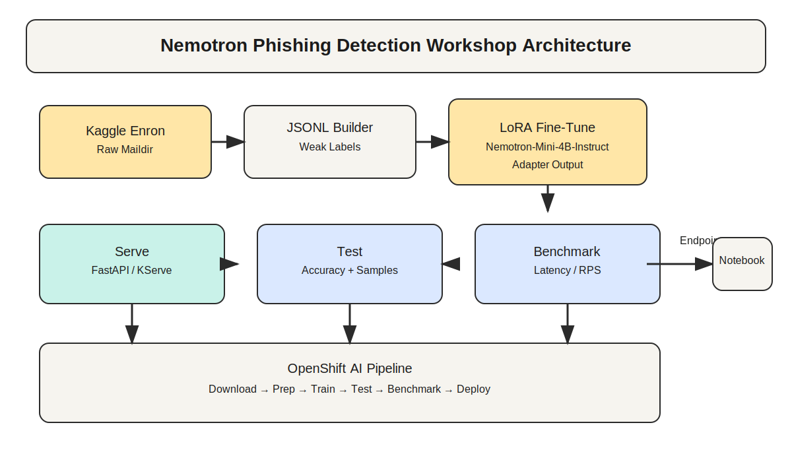

# Nemotron Phishing Detection Workshop

This workshop walks you through fine-tuning a Nemotron model on the Enron email dataset for phishing detection, serving the model, testing it, and benchmarking it. It also includes a Kubeflow/ OpenShift AI pipeline definition and a notebook for calling a deployed endpoint.

## Architecture


## Prerequisites
- Python 3.10+
- NVIDIA L4 GPU instance with CUDA drivers
- Kaggle API token for dataset download

## Quickstart (local)
1. Install dependencies:
   ```bash
   # Install a CUDA-enabled PyTorch build if needed, then:
   pip install -r requirements.txt
   ```
   If your environment does not already have CUDA-enabled PyTorch, install it first. Example for CUDA 12.1:
   ```bash
   pip install torch --index-url https://download.pytorch.org/whl/cu121
   ```
   For vLLM serving, install the extra requirements:
   ```bash
   pip install -r requirements-vllm.txt
   ```
2. Set Kaggle credentials:
   ```bash
   export KAGGLE_USERNAME="your_username"
   export KAGGLE_KEY="your_key"
   ```
3. Run the full workflow:
   ```bash
   bash scripts/run_training.sh
   ```
4. Serve the model locally with vLLM:
   ```bash
   python scripts/serve_vllm.py --model_name nvidia/Nemotron-Mini-4B-Instruct --adapter_dir outputs/adapter
   ```
   The adapter is registered as the OpenAI model name `phishing`.
5. Test the model (vLLM OpenAI-compatible endpoint):
   ```bash
   python scripts/test_model.py --api openai --endpoint http://127.0.0.1:8000/v1/completions --openai_model phishing
   ```
6. Benchmark the model:
   ```bash
   python scripts/benchmark_model.py --api openai --endpoint http://127.0.0.1:8000/v1/completions --openai_model phishing
   ```

## Fine-tuning Options
- LoRA (default): `python scripts/train.py --tuning_method lora`
- Full SFT: `python scripts/train.py --tuning_method sft` (saved to `outputs/sft_model`)
- Serve SFT output: `python scripts/serve_vllm.py --model_name outputs/sft_model`
- NVIDIA backends: pass a command that uses your preferred NVIDIA library.
  Example with NeMo (replace the command with your actual setup):
  ```bash
  python scripts/train.py --backend nvidia --tuning_method lora \
    --nvidia_library nemo \
    --nvidia_command "python -m nemo_launcher --data_dir $DATA_DIR --output_dir $OUTPUT_DIR --model_name $MODEL_NAME"
  ```
  The NVIDIA command receives `DATA_DIR`, `OUTPUT_DIR`, `MODEL_NAME`, and `TUNING_METHOD` env vars.

## NeMo Stack (NeMo Framework Launcher)
If you use the NeMo Framework Launcher, the default NeMo backend runs `scripts/nemo_launcher_finetune.sh`.
Set the launcher path and run:
```bash
export NEMO_FRAMEWORK_LAUNCHER_DIR=/opt/NeMo-Framework-Launcher
python scripts/train.py --backend nemo --tuning_method lora
```
Notes:
- The NeMo launcher expects JSONL fields `input` and `output` (added by `scripts/prepare_jsonl.py`).
- `MODEL_NAME` should point to a NeMo `.nemo` checkpoint or a supported NeMo restore path.
- Override devices, batch sizes, or other settings via env vars like `TRAINER_DEVICES` or `NEMO_EXTRA_ARGS`.

## Workshop Notebooks
- `notebooks/01_workshop_fine_tune.ipynb`: end-to-end fine-tuning walkthrough
- `notebooks/02_openshift_ai_infer.ipynb`: call an OpenShift AI endpoint

## Data Notes
The Enron dataset is not labeled for phishing. This workshop uses a simple keyword heuristic to generate a weak label for phishing vs benign. Replace the heuristic or inject your own labels if you need higher fidelity.

## OpenShift AI Pipeline
The pipeline definition is in `pipelines/openshift_ai_pipeline.py`. It assumes you build a container image with this repository and pass the image to the pipeline. See the header comment in that file for usage.
To compile the pipeline YAML locally:
```bash
python pipelines/compile_pipeline.py --output nemotron_pipeline.yaml
```
Pipeline parameters include `finetune_backend` (`trl` or `nvidia`), `tuning_method` (`lora` or `sft`), and `nvidia_command` for NVIDIA-backed training.

## License / Data Terms
The Enron email dataset is sourced from Kaggle: https://www.kaggle.com/datasets/wcukierski/enron-email-dataset. Follow Kaggle's terms and license conditions.
# fine-tuning-workshop
